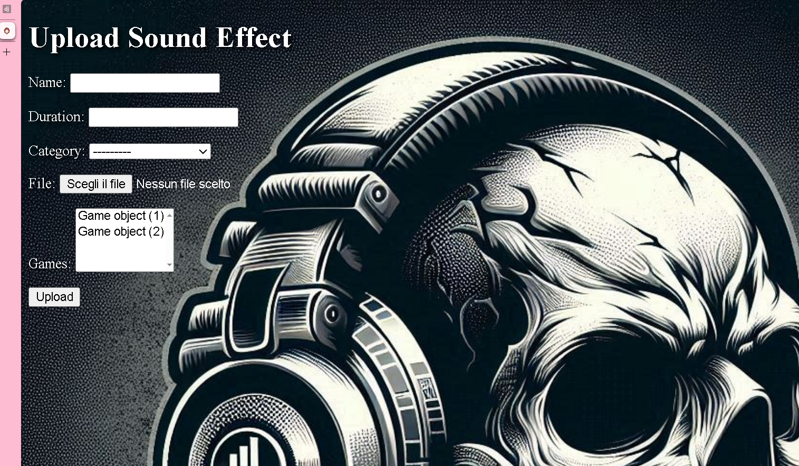
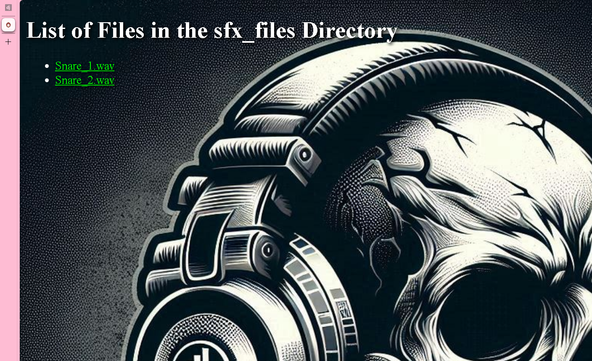

# Project Pages Summary

This document describes the functionalities of the different pages in the Django project for sound effects management.

## Project Description

The "Sfx Management with Django" project is a management system for handling sound effects. Users can upload new sound effects, view a list of uploaded files, and listen to the files directly from the browser. The application uses Django as the backend framework and includes features for managing media files.

## How to Use the Application

To start using the application locally, follow these steps:

1. **Clone the Repository:**
   ```bash
   git clone https://github.com/Mike014/SFX-Management.git  # URL of the repository
   cd SFX-Management  # Enter the repository directory

1. **Start the Development Server:**
   ```bash
   python manage.py runserver  # Start the development server

## Home Page

- **URL:** [http://127.0.0.1:8000/](http://127.0.0.1:8000/)
- **Template File:** [home.html](#home.html-context)
- **Description:** The home page of the project. From here, users can navigate to other pages such as uploading sound effects and listing files. The page includes a title and a navigation menu.
- **Screenshot:**
  

## Upload Page

- **URL:** [http://127.0.0.1:8000/upload/](http://127.0.0.1:8000/upload/)
- **Template File:** [upload.html](#upload.html-context)
- **Description:** This page allows users to upload new sound effects. It includes a form for file upload and a submit button. The page uses a background image and custom styles.
- **Screenshot:**
  

## Success Page

- **URL:** Displayed after a successful upload, with a dynamic URL based on the uploaded sound effect's ID.
- **Template File:** [success.html](#success.html-context)
- **Description:** This page confirms that the sound effect has been successfully uploaded. It includes a link to upload another sound effect and an audio player to listen to the newly uploaded file.
- **Screenshot:**
  

## File List Page

- **URL:** [http://127.0.0.1:8000/list_files/](http://127.0.0.1:8000/list_files/)
- **Template File:** [list_files.html](#list_files.html-context)
- **Description:** This page shows a list of all files in the `sfx_files` directory. Each file is linked so it can be downloaded or listened to directly from the browser. The page uses a background image and custom styles.
- **Screenshot:**
  

## Notes

- All pages use custom CSS styles and a common background image.
- Navigation links are present on the home page to facilitate access to other pages of the site.

If you need further information or assistance, feel free to ask!

   

